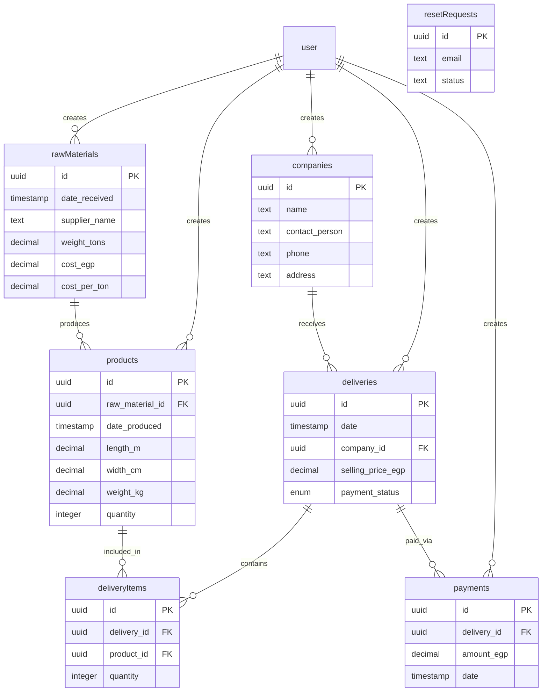

# Architecture Reference

> Technical architecture documentation for the Prime Paper Company application.

---

## Tech Stack

| Layer | Technology | Version |
|---|---|---|
| Framework | Next.js (App Router) | 16 |
| Language | TypeScript | — |
| Styling | Tailwind CSS + shadcn/ui | v4 |
| Database | PostgreSQL (Neon) | — |
| ORM | Drizzle ORM | — |
| Auth | Better Auth | — |
| API Layer | tRPC | — |
| Data Fetching | TanStack React Query | — |
| i18n | next-intl | — |
| Charts | Recharts | — |
| Font | Cairo (Arabic + Latin) | — |

---

## Directory Structure

```
src/
├── app/
│   ├── page.tsx                    # Public Landing Page
│   ├── layout.tsx                  # Root layout (providers, fonts, dir)
│   ├── globals.css                 # Design tokens & global styles
│   ├── (app)/                      # Protected route group
│   │   ├── layout.tsx              # Sidebar + SidebarInset wrapper
│   │   ├── dashboard/page.tsx      # Dashboard analytics
│   │   ├── companies/page.tsx      # Companies CRUD
│   │   ├── deliveries/             
│   │   │   ├── page.tsx            # Deliveries list
│   │   │   └── [id]/page.tsx       # Delivery detail + payments
│   │   ├── products/page.tsx       # Products CRUD
│   │   ├── raw-materials/page.tsx  # Raw Materials CRUD
│   │   ├── settings/page.tsx       # Language + Account settings
│   │   └── invite/                 
│   │       ├── page.tsx            # Admin invite + reset queue
│   │       └── client.tsx          # InviteClient component
│   ├── auth/
│   │   ├── login/page.tsx          # Login
│   │   ├── signup/page.tsx         # Public Signup
│   │   ├── forgot-password/page.tsx # Reset request form
│   │   └── reset-password/         # ⚠️ EMPTY — not implemented
│   ├── api/
│   │   ├── auth/[...all]/route.ts  # Better Auth API handler
│   │   └── trpc/[trpc]/route.ts    # tRPC API handler
│   └── actions/                    # ⚠️ Legacy — should be empty
│
├── server/                         # tRPC Onion Architecture Backend
│   ├── trpc.ts                     # Base tRPC config (createRouter, procedures)
│   ├── root.ts                     # Root appRouter (merges all domain routers)
│   ├── analytics/                  # Dashboard stats domain
│   │   ├── router.ts
│   │   ├── services.ts
│   │   └── types.ts
│   ├── companies/                  # Companies CRUD domain
│   │   ├── router.ts
│   │   ├── db.ts
│   │   ├── services.ts
│   │   └── types.ts
│   ├── deliveries/                 # Deliveries + Payments domain
│   │   ├── router.ts
│   │   ├── db.ts
│   │   ├── services.ts
│   │   └── types.ts
│   ├── products/                   # Products CRUD domain
│   │   ├── router.ts
│   │   ├── db.ts
│   │   ├── services.ts
│   │   └── types.ts
│   ├── raw-materials/              # Raw Materials CRUD domain
│   │   ├── router.ts
│   │   ├── db.ts
│   │   ├── services.ts
│   │   └── types.ts
│   └── users/                      # Password reset tickets
│       └── router.ts
│
├── components/
│   ├── analytics/ui/               # AnalyticsClient (dashboard)
│   ├── companies/ui/               # CompaniesClient
│   ├── deliveries/ui/              # DeliveriesClient, DeliveryDetailClient
│   ├── products/ui/                # ProductsClient
│   ├── raw-materials/ui/           # RawMaterialsClient
│   ├── settings/ui/                # UserSettingsClient
│   ├── layout/                     # AppSidebar, Header
│   └── ui/                         # shadcn/ui primitives
│
├── db/
│   ├── index.ts                    # Drizzle client + Neon connection
│   └── schema.ts                   # All table schemas
│
├── lib/
│   ├── auth.ts                     # Better Auth server config
│   └── auth-client.ts              # Better Auth client
│
├── trpc/
│   └── react.tsx                   # TRPCReactProvider + client hooks
│
├── i18n/
│   └── request.ts                  # Locale resolution
│
├── hooks/                          # Custom hooks (useInfiniteScroll, etc.)
│
└── middleware.ts                   # Route protection + public path rules

messages/
├── ar.json                         # Arabic translations
└── en.json                         # English translations
```

---

## Data Flow Pattern

```
User Action → React Component
  → tRPC Hook (useQuery / useMutation)
    → tRPC Router (src/server/{domain}/router.ts)
      → Service Layer (src/server/{domain}/services.ts)
        → Database Layer (src/server/{domain}/db.ts)
          → Drizzle ORM → Neon PostgreSQL
```

**On mutation success:**
```
useMutation.onSuccess → utils.{domain}.{query}.invalidate()
  → React Query refetches → UI updates automatically
```

---

## Authentication Flow

1. User visits any protected route (`/(app)/*`)
2. `middleware.ts` checks for `better-auth.session_token` cookie
3. If no cookie → redirect to `/auth/login`
4. If cookie exists → allow through
5. Public paths (`/`, `/auth/*`, `/api/*`) bypass auth check entirely

### Role System
| Role | Privileges |
|---|---|
| `dev` | Full access — auto-assigned to all new signups |
| `admin` | Full access — assigned manually via invite |
| `viewer` | Read-only access — assigned manually via invite |
| `user` | Default Better Auth role (unused) |

---

## Database Schema (ERD)



---

## Localization

- **Default locale:** Arabic (`ar`)
- **Direction:** Automatically set via cookie-based `locale` value
- **Translation files:** `messages/ar.json`, `messages/en.json`
- **Server-side:** `getTranslations("namespace")`
- **Client-side:** `useTranslations("namespace")`
- **Namespaces:** `app`, `nav`, `dashboard`, `rawMaterials`, `products`, `companies`, `deliveries`, `invite`, `settings`, `auth`, `landing`, `common`
